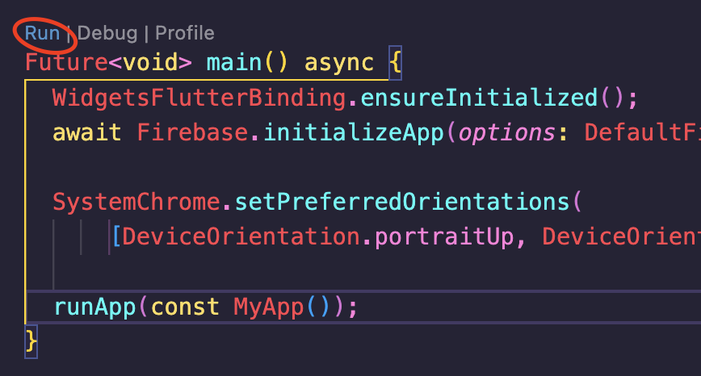

# TFG: Aplicación Móvil para Gestión de una Peña Deportiva
##### Autor: Alberto Llamas González
##### Director: Juan José Escobar Pérez

### Pasos a seguir para la correcta instalación y ejecución del proyecto

Tenemos dos opciones para poder ejecutar la aplicación. 

1. Si simplemente queremos utilizar la aplicación, basta con instalar en cualquier dispositivo Android el archivo .apk correspondiente a nuestra arquitectura del sistema. El archivo basado en ARMs de 32 bits (armeabi-v7a) debería ser el elegido para la gran parte de dispositivos.
   
2. Si queremos ejecutar la aplicación para poder modificar el código, necesitaremos:
   
   1. Un IDE, recomendable Visual Studio Code o Android Studio.
   2. Instalar Flutter. Podemos encontrar los pasos a seguir en su documentación (MacOS: https://esflutter.dev/docs/get-started/install/macos, Windows: https://esflutter.dev/docs/get-started/install/windows, Linux: https://esflutter.dev/docs/get-started/install/linux ).
   3. Instalar la extensión de Flutter en Visual Studio Code.
   4. Crear un nuevo proyecto de Flutter y comprobar que se ejecuta correctamente en nuestro dispositivo (https://docs.flutter.dev/tools/vs-code).
   5. Una vez comprobado que podemos ejecutar proyectos, cambiar la carpeta lib por la proporcionada y el archivo pubspec.yaml por el proporcionado, así como la carpeta assets. 
   6. Tras esto, ejecutamos en la línea de comandos:
   `flutter clean` y, posteriormente,
   `flutter run`

También es necesario, integrar Firebase en el proyecto. Para ello, es necesario solicitar permiso de escritura en la base de datos, enviando un correo electrónico a la cuenta alberto.ll.go@gmail.com. Tras la confirmación del traspaso de permisos, basta con realizar los dos primeros pasos sugeridos en la documentación de [Firebase](https://firebase.google.com/docs/flutter/setup?hl=es-419&platform=ios) para finalizar la configuración. Para más información se puede consultar la [documentación de Firebase](https://firebase.google.com/docs/guides?authuser=1&hl=es)
De esta forma tendríamos ya nuestra aplicación lista para su funcionamiento. Podemos ejecutar de nuevo nuestra aplicación desde el archivo main.dart pulsando Run encima de la función main() o volviendo a ejecutar ``flutter run``.

